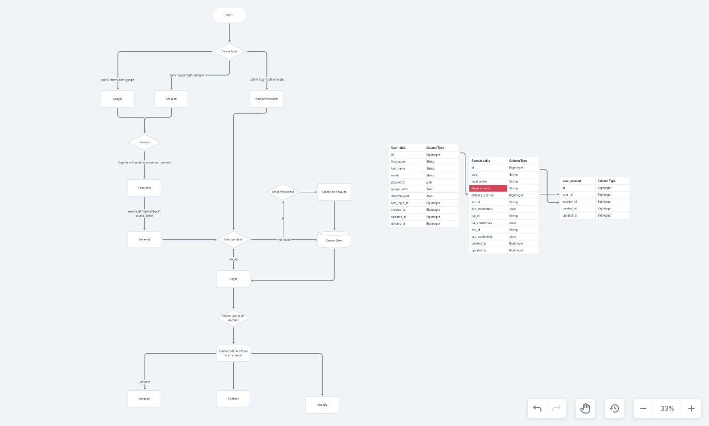

# ECOMM PULSE APIs

Core logic and apis for Ecomm Pulse.

## Technical Details

- Python 3.8 - preferable
- Flask 2.2.2
- Postgresql (Database) 12.12
- SQLAlchemy (ORM for the project)
    - All the SQL queries are written with SQLAlchemy in mind
    - Has great performance compared to Django's default ORM
- Alembic
    - DB migration tool, to use with SQLAlchemy
    - To generate migrations from models & reflect those migrations in the database
- Swagger
    - For documenting and testing APIs


## Directory Structure

- `apps/`
     - Contains all the logic of components in separate directories related to app.
     - Static files (CSS, JS, & Plugins (Bootstrap4, SB-Admin2))  
     - Models' logic
     - Templates (layouts & pages for email's)
     - Views (For url redirection and their logic)
- `config/`
    - Contains sample_config.yml file
- `migrations/versions/`
    - Contains all the Alembic migrations
    - File Naming Convention: `revisionID_description.py`
- `providers/`
    - `mail.py` contains mail sending logic.
- `workers/`
  - Contains a workers according to tasks.  
- `manage.py`
  - Contains seeder command for generating super admin.
  - Run this command to create super_admin : `python manage.py create_super_user`


## Installation Instructions

### Create Virtual Environment

- After cloning the repository, execute following commands
```
cd ecomm-pulse-api

# Create & Activate virtual environment
python3.8 -m venv venv
source venv/bin/activate

# Install all the packages
pip install --upgrade pip
pip install -r requirements.txt
```
- If you get an error regarding any requirement while installing requirements. Comment that requirement from requirements.txt.
- Manually install requirement without mentioning version.
- continue installing requirements
- uncomment requirement from requirements.txt file.


### Configuring the Database

- Run following commands to install postgresql in the system:
```
sudo apt-get update
sudo apt-get install python3-pip python3-dev libpq-dev postgresql postgresql-contrib
```

#### Changing default isolation_level :
- In alembic migration transaction is committed only after all version files implemented there can be some scenario in which you are altering table and reading that table data that will lead to deadlock issue.
- we can overcome by setting isolation level to autocommit.
- Put below line in config.yml file for updating isolation_level to autocommit.
- In SQLAlchemy, the isolation_level parameter is used to specify the isolation level of a database transaction.
- Isolation levels control the degree to which one transaction is isolated from the effects of other transactions.
- Isolation levels do not affect whether or not a transaction is automatically committed.
```
SQLALCHEMY_ENGINE_OPTIONS : {'isolation_level': 'AUTOCOMMIT'}
```

#### Create the database

```
# Login to postgres session
sudo -u postgres psql

# Create a database with below command.
CREATE DATABASE 'ecomm-pulse';

# Press \q to exit the postgres session
\q
```
- run migrations using `flask db upgrade`


#### Create config.yml file

- After installing requirements.txt create file `config/config.yml` file copying from `config/config.sample.yml`.
    - Edit `config.yml` by updating it with your secret key, and other database credentials.
    - Else ask for already updated `config.yml` file from another team member.


## Setup Redis
- For starting redis server run below commands:
```
wget http://download.redis.io/releases/redis-6.0.6.tar.gz
tar xzf redis-6.0.6.tar.gz
cd redis-6.0.6
make
```
- Run the Redis server in a separate terminal window on the default port with the command `src/redis-server` from the directory where it's installed.

- For starting RQ Worker run below commands:
```
rqscheduler -i INTERVAL (How often the scheduler checks for new jobs to add to the queue in seconds.)
example :  rqscheduler -i 1 -v

Refer this article for more details: https://github.com/rq/rq-scheduler

rq worker QUEUE_NAME --with-scheduler
```

## Adding Rate limiting
- For adding rate limiting you have to create instance of Flask-Limiter in Application init file.
```
limiter = Limiter(app=app, key_func=, strategy=, key_prefix=, storage_uri=)
```
- Must have arguments while creating Instance:
  - key_func :  A callable that returns the domain to rate limit (e.g. username, ip address etc)
  - strategy : The rate limiting strategy to use. we can use one of fixed-window, fixed-window-elastic-expiry, or moving-window.
  - key_prefix : Prefix that is prepended to each stored rate limit key and app context global name.
  - storage_uri : A storage location conforming to the scheme in storage-scheme.
- You can use it as a decorator on API logic method as below:
 ```
  @limiter.limit(limit_value='1/ 30 second', key_func=lambda: request.get_json(force=True).get('email_id'))
```
- You can find more details in this link : https://flask-limiter.readthedocs.io/en/stable/index.html

### Alembic - Generating Migrations

- Once models are changed for any component, run following commands to create its migrations file & reflect it into the database
```
flask db migrate -m "Write description of migration here" --rev-id=REVISION_ID
```
<!--alembic revision --autogenerate -m "Write description of migration here"-->

- Rename file generated inside `migrations/versions/` with the following naming convention: `revisionID_description`
    - ex: `0005_add_country_code_in_org_table.py`
    - Also update the Revision ID `revision` & `down_revision` in the generated file to match the version number

- Run `flask db upgrade` to have this new migration reflected in the database.

- Note: Once you delete all the tables (i.e, when freshly migrating to DB), run `flask db upgrade` to have all the changes reflected in the database.

##### Important alembic commands for reference
- To rollback 1 migration: `flask db downgrade -1`
- Downgrade to specific migration: `flask db downgarde <revision>`


## Code Flow

### Swagger Documentation
- url for swagger is ecomm-pulse-api.activ.space/api-docs
- Whenever you make any changes in API or DB Schema You must have to make changes in `app/static/swagger_json/swagger.json` file


### Pre-Commit Hook
- Open below link to get basic understanding about pre-commit hooks :
`https://ljvmiranda921.github.io/notebook/2018/06/21/precommits-using-black-and-flake8/`
- The pre-commit hook is run first, before you even type in a commit message.
- It's used to inspect the snapshot that's about to be committed, to see if you've forgotten something, to make sure tests run, or to examine whatever you need to inspect in the code.
- Run `pip install pre-commit` to install the pre-commit package manager.
- Create a configuration file named `.pre-commit-config.yaml`
- You can generate a very basic configuration using `pre-commit sample-config`
- Run `pre-commit install` to set up the git hook scripts.
- To check all files for newly added hooks run `pre-commit run --all-files`
- Open `https://pre-commit.com/hooks.html` this URL to read about more useful hooks.

### Various Pre-Commit Hooks with their uses:
- check-json : Attempts to load all json files to verify syntax.
-  pretty-format-json : Checks that all your JSON files are pretty. "Pretty" here means that keys are sorted and indented.
- check-merge-conflict : Check for files that contain merge conflict strings.
- check-yaml : Attempts to load all yaml files to verify syntax.
- detect-private-key : Checks for the existence of private keys.
- double-quote-string-fixer : This hook replaces double-quoted strings with single quoted strings.
- end-of-file-fixer : Makes sure files end in a newline and only a newline.
- requirements-txt-fixer : Sorts entries in requirements.txt and removes incorrect entry for pkg-resources==0.0.0
- sort-simple-yaml : Sorts simple YAML files which consist only of top-level keys, preserving comments and blocks.
- trailing-whitespace : trims trailing whitespace.
- check-added-large-files : prevents giant files from being committed.
- no-commit-to-branch : prevent code commit on specified branches.
- text-unicode-replacement-char : Forbid files which have a UTF-8 Unicode replacement character.
- python-use-type-annotations : Enforce that python3.6+ type annotations are used instead of type comments.
- absolufy-imports : Automatically convert relative imports to absolute.
- vulture : Vulture finds unused code in Python programs.
- zimports : Reformat Python imports so that they can pass flake8-import-order.
- rm-unneeded-f-str : Find and replace unneeded f-strings in your code.
- flake8 : Powerful tool that checks our code’s compliance to PEP8.
- flake8-requirements : This module provides a plug-in for flake8, which checks/validates package import requirements. It reports missing and/or not used project direct dependencies.
- flake8-force-keyword-arguments : A flake8 plugin that is looking for function calls and forces to use keyword arguments if there are more than X (default=2) arguments.
- flake8-comprehensions : A flake8 plugin that helps you write better list/set/dict comprehensions.
- isort : isort is a Python utility / library to sort imports alphabetically, and automatically separated into sections and by type.
- autopep8 : autopep8 automatically formats Python code to conform to the PEP 8 style guide.
- remove-print-statements : Remove print statement from code.
- pylint : Pylint is a static code analyser for Python 2 or 3.
- pytype : Pytype checks and infers types for your Python code - without requiring type annotations.
- interrogate : interrogate checks your code base for missing docstrings.
- pep8-naming : Check your code against PEP 8 naming conventions.
- pytest-check : A pytest plugin that allows multiple failures per test. pytest-check allows multiple failed "checks" per test function, so you can see the whole picture of what's going wrong.
- detect-aws-credentials : It searches for the aws credentials configured on your local machine in your code.
- name-tests-test : This hook verifies test files are named correctly.
  - `--pytest` (the default) : ensure tests match `.*_test\.py`
  - `--pytest-test-first` : ensure tests match `test_.*\.py`
  - `--django` / `--unittest` : ensure tests match `test.*\.py`

### Helpers
- The helper folder in our 'app' of root contains the utility.py file for functions like generating randon numbers, decode and encode functions etc
- The constants.py file has all the enumerations and functions to get there names and values
- It also contains custom decorations

### Workers
- The workers folder in our root contains files related to specific tasks.
- Email workers have email related functions
- S3 worker has function to upload and delete file from boto

### App logs
- The logging output goes into the app.log file whose path depends on LOG_FILE_PATH of the config file

### Models and Relations
- User:
  - It contains details of each User and their personal details.

## Branch Naming Convention
- Refer to the link below to understand how to name a branch
  - https://bitbucket.org/edugemservice/workspace/snippets/Mzy8GL

 Branches 'master' and 'development' are no commit branches, which means one cannot directly commit and push to them.


## Unit Testing
- We have used pytest for writing test cases.
- All Unit Tests are under the `tests` directory.
- We need to create the test db in the postgres, default config name is: `ecomm_pulse_api_local_test` which can be updated as well.
- Tables will be created in the db on each time we run testing setup and will be cleared once done.
#### conftest.py file
- This file contains logic for creating temporary DB and initializing app for testing.
- We have initialized org_admin_client and super_admin_client in this file which can be used in all test cases.
- To preform the data cleanup, write the cleanup logic after the yield in client function of conftest.py
- All the configuration or generic test functions need to be written in conftest.py.
#### Other files
- we have created separate file per module for writing their test cases as below:
- 1. `test_super_admin.py` : This file contains all test cases related to super admin role.
- 2. `test_users.py` : This file contains all test cases related to user onboarding process.  
- 3. `test_suppliers.py` : This file contains all test cases related to supplier module.
- 4. `test_exp_cat.py` : This file contains all test cases related to expense category module.

#### To add pytest in pre-commit add below code in `pre-commit-config.yaml`
```
  - repo: local
  hooks:
    - id: pytest-check
      name: pytest-check
      entry: pytest
      language: system
      pass_filenames: false
      always_run: true
```

 ## Downloading and installing the AWS CLI
- Refer to the link below to understand how to install the AWS CLI
 https://docs.aws.amazon.com/cli/latest/userguide/getting-started-install.html

 ## Simple configuration of the AWS CLI

 - Once you have installed the AWS CLI, you now need to configure the application to be able to connect to your AWS account.  To do so, enter the following from your command prompt:

```
 aws configure
 ```

 Through aws configure, the AWS CLI will prompt you for four pieces of information. The first two are required. These are your AWS access key ID and AWS secret access key, which serve as your account credentials. You can generate new credentials within AWS Identity and Access Management (IAM) if you do not already have them. The other information you will need is region and output format, which you can leave as default.

 The AWS access key ID and AWS secret access key are used to authenticate your AWS account. This authorizes you to carry out specific tasks and functions as defined by your permissions level.  

 **IMPORTANT** : When the access keys are created, you are prompted to download and save the details. The secret access key ID will only be displayed once, and if you lose it, then you’ll have to delete the associated access key ID and recreate new keys for the user.

To set up cognito with idp we will require google and and amazon client credentials and would require to add callback url's in order for cognito to get response and save user details:


 ## Setting up Amazon Cognito:
1. Go to the Amazon Cognito Console: https://console.aws.amazon.com/cognito/
2. Select the region where you want to create the user pool from the region selector in the top-right corner.
3. Click on "Manage User Pools" and then "Create a user pool".
4. Provide a name for user pool and click on the "Review defaults" button.
5. Review the default settings for the user pool and make any necessary changes according to requirements (e.g., password policies, user attributes, etc.).
6. Scroll down to the "App clients" section and click on "Add an app client".
7. Enter a name for app client.
8. Optionally, we can configure additional settings for our app client, such as OAuth 2.0 settings, allowed OAuth scopes, etc.
9. We need to select Google and Login with Amazon
10. Scroll down to the "Federation" section and click on "Identity providers".
11. Click on "Add provider" and select "Google" and "Login with Amazon" based on the IDP you want to add.
12. Enter the necessary details, including the client ID and client secret we obtained from the respective IDP consoles (Google and Amazon Developer Console).
13. Configure any additional settings specific to the IDP.
14. Click on "Add provider" to add the IDP to user pool.
15. Review the rest of the user pool settings and make any desired changes.
16. Click on "Create pool" to create user pool.
17. Once the user pool is created, We will have the necessary credentials and configuration details available:

User Pool ID: This uniquely identifies your user pool and is required when interacting with the user pool via the AWS SDK or API.
App client ID: This identifies the app client within the user pool and is used for client-side interactions.


 ## Setting up Google IDP with Amazon Cognito:
Visit the Google Developers Console: https://console.developers.google.com/
1. Create a new project or select an existing one.
2. Enable the "Google+ API" in the API Library.
3. In the left sidebar, go to "Credentials" and click "Create Credentials" -> "OAuth client ID".
4. Configure the OAuth consent screen with the required details (e.g., product name, email address, etc.).
5. Select "Web application" as the application type.
6. Add the authorized JavaScript origins:
Origin: `https://<your-cognito-domain>.auth.<region>.amazoncognito.com`
7. Add the authorized redirect URIs:
URI: `https://<your-cognito-domain>.auth.<region>.amazoncognito.com/oauth2/idpresponse`
8. Save the OAuth client ID and client secret generated by Google.
9. Provide the client ID and client secret to Cognito when configuring the Google IDP.


## Setting up Amazon IDP with Amazon Cognito:

Visit the Amazon Developer Console: https://developer.amazon.com/
1. Sign in and navigate to the "Developer Console" section.
2. Create a new security profile or select an existing one.
3. In the "Web Settings" tab, add the allowed origins:
 Origin: `https://<your-cognito-domain>.auth.<region>.amazoncognito.com`
4. In the "Web Settings" tab, add the allowed return URLs:
 Return URL: `https://<your-cognito-domain>.auth.<region>.amazoncognito.com/oauth2/idpresponse`
5. Save the security profile.
6. Provide the Client ID and Client Secret generated by Amazon to Cognito when configuring the Amazon IDP.


Make sure to replace `<your-cognito-domain>` with the actual domain name which is been configured for Cognito user pool, and `<region> `with the AWS region where your user pool is located.





## Schedular's

| Schedular                            | Timings                          | Cron          |
| :---                                 | :----:                           | ---:          |
| Create Amazon Reports                | At 00:00.                        | 0 0 * * *     |
| Verify Amazon Reports                | At every minute.                 | * * * * *     |
| Create Ad Reports                    | At 02:00.                        | 0 2 * * *     |
| Verify Ad Reports                    | At every minute.                 | * * * * *     |
| Order Reports                        | At every 5th minute.             | */5 * * * *   |
| Finance API                          | At minute 0 past every 6th hour. | 0 */6 * * *   |
| Ledger Summary Reports               | At minute 0 past every 6th hour. | 0 */6 * * *   |
| Item Master Catalogue                | At 08:00.                        | 0 8 * * *     |
| Fba Returns Report                   | At 04:00 on Sunday.              | 0 4 * * 0     |
| Fba Reimbursements Report            | At 04:00 on Sunday.              | 0 4 * * 0     |
| Fba Customer Shipment Sales Report   | At 04:00 on Sunday.              | 0 4 * * 0     |

## Amazon API List

```
 Host     : sellingpartnerapi-na.amazon.com
 BasePath : /
 Schemes  : HTTPS
 ```

| Method | Path                                       | Operation                  | Rate (requests per second)| Burst  |
|:---    | :---                                       | :----:                     | :----:                    | ---:   |
|POST    | /reports/2021-06-30/reports                | createReport               |                    0.0167 |     15 |
|GET     | /reports/2021-06-30/reports                | getReports                 |                    0.0222 |     30 |
|GET     | /reports/2021-06-30/reports/{reportId}     | getReport                  |                         2 |     15 |
|GET     | /finances/v0/financialEventGroups          | listFinancialEventGroups   |                       0.5 |     30 |
|GET     | /catalog/2022-04-01/items                  | searchCatalogItems         |                         2 |      2 |

## Amazon Ad's API List
```
 Host     : advertising-api.amazon.com
 BasePath : /
 Schemes  : HTTPS
 ```

| Ad Type             | Method | Path                     | Operation                  | Rate (requests per second)| Burst  |
|:---                 |:---    | :---                     | :----:                     | :----:                    | ---:   |
|Sponsored Brands	    |POST    | /v2/hsa/keywords/report  | createReport               |                           |        |
|Sponsored Products   |GET     | /reporting/reports       | createReport               |                           |        |
|Sponsored Display	  |GET     | /sd/productAds/report    | createReport               |                           |        |

## API List's used for Ecomm-pulse
##### 1. Item Master
- Report Type: GET_MERCHANT_LISTINGS_ALL_DATA
- You can find more details in this link : https://developer-docs.amazon.com/sp-api/docs/inventory-reports-attributes#get_merchant_listings_all_data

##### 2. Sales and Traffic Report
- Report Type: GET_SALES_AND_TRAFFIC_REPORT
- You can find more details in this link : https://developer-docs.amazon.com/sp-api/docs/seller-retail-reports-attributes#get_sales_and_traffic_report

##### 3. Ledger Summary Report
- Report Type: GET_LEDGER_SUMMARY_VIEW_DATA
- You can find more details in this link : https://developer-docs.amazon.com/sp-api/docs/fba-inventory-reports-attributes#get_ledger_summary_view_data

##### 4. FBA Customer Returns
- Report Type: GET_FBA_FULFILLMENT_CUSTOMER_RETURNS_DATA
- You can find more details in this link : https://developer-docs.amazon.com/sp-api/docs/fba-customer-concessions-reports-attributes#get_fba_fulfillment_customer_returns_data

##### 5. FBA Reimbursements
- Report Type: GET_FBA_REIMBURSEMENTS_DATA
- You can find more details in this link : https://developer-docs.amazon.com/sp-api/docs/fba-payments-reports-attributes#get_fba_reimbursements_data

##### 6. FBA Customer Shipment Sales
- Report Type: GET_FBA_FULFILLMENT_CUSTOMER_SHIPMENT_SALES_DATA
- You can find more details in this link : https://developer-docs.amazon.com/sp-api/docs/fba-sales-reports-attributes#get_fba_fulfillment_customer_shipment_sales_data

##### 7. Order Report
- Report Type: GET_FLAT_FILE_ALL_ORDERS_DATA_BY_ORDER_DATE_GENERAL
- You can find more details in this link : https://developer-docs.amazon.com/sp-api/docs/order-tracking-reports-attributes#get_flat_file_all_orders_data_by_order_date_general

##### 8. Finance Event List
- Report Type: LIST_FINANCIAL_EVENTS
- You can find more details in this link : https://developer-docs.amazon.com/sp-api/docs/finances-api-reference

##### 9. Catalog
- Report Type: GET_CATALOG_ITEM
- You can find more details in this link : https://developer-docs.amazon.com/sp-api/docs/catalog-items-api-v2022-04-01-reference

##### 10. Sponsored Brand Banner
- Report Type: GET_SPONSORED_BRAND_BANNER_V2
- You can find more details in this link : https://advertising.amazon.com/API/docs/en-us/guides/reporting/v2/report-types#keyword-reports

##### 11. Sponsored Brand Video
- Report Type: GET_SPONSORED_BRAND_VIDEO_V2
- You can find more details in this link : https://advertising.amazon.com/API/docs/en-us/guides/reporting/v2/report-types#keyword-reports

##### 12. Sponsored Display
- Report Type: GET_SPONSORED_DISPLAY_V2
- You can find more details in this link : https://advertising.amazon.com/API/docs/en-us/guides/reporting/v2/report-types#product-ad-reports

##### 13. Sponsored Product
- Report Type: GET_SPONSORED_PRODUCT_V3
- You can find more details in this link : https://advertising.amazon.com/API/docs/en-us/guides/reporting/v3/report-types#advertised-product-reports
